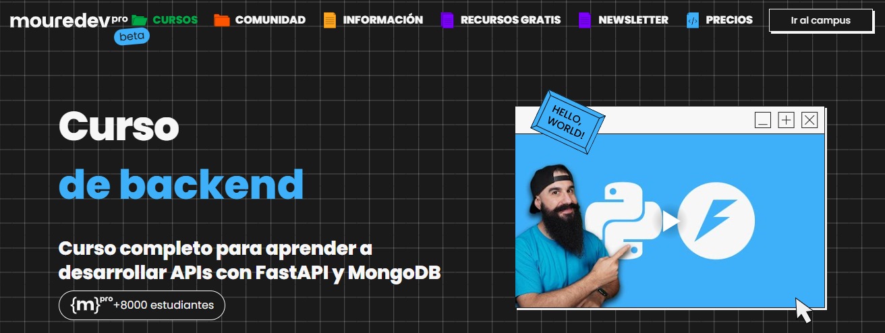

# Curso Backend con Python y FastAPI  

      

  

> Espacio de estudio personal para aprender y practicar desarrollo backend con Python a través de un curso completo de FastAPI. Aquí construiré paso a paso una API REST con autenticación, conectada a una base de datos MongoDB y desplegada en Vercel. 
> 
> [Thanks to MoureDev!](https://moure.dev) 🤘

## 🔎 ¿Qué encontrarás?  

### 🗂️ Aprendizaje estructurado  

- Fundamentos de **FastAPI** y creación de endpoints básicos 
 
- **Autenticación y autorización** con **JWT**  
- Integración con base de datos **NoSQL (MongoDB)**  
- Manejo de **modelos y validación de datos** con Pydantic  
- Buenas prácticas en el desarrollo de APIs  
- Despliegue del proyecto en **Vercel**  

### 🧪 Pruebas personales  

- Experimentación con nuevos conceptos del curso 
 
- Ejemplos adicionales y casos de uso propios  
- Fragmentos de código para reforzar la práctica  

### 🥇 Proyecto final  

- **API REST** completa con autenticación  

- Conexión a **MongoDB**  
- Despliegue en un entorno real con **Vercel**  

## 🎯 Objetivos del repositorio  

- Comprender el ciclo de desarrollo de una **API REST moderna**
  
- Practicar integración de **FastAPI + MongoDB**  
- Desplegar aplicaciones en la nube con confianza  
- Sentar una base sólida sobre **Backend** usando Python  

> Made with '\u{2665}' (♥)
